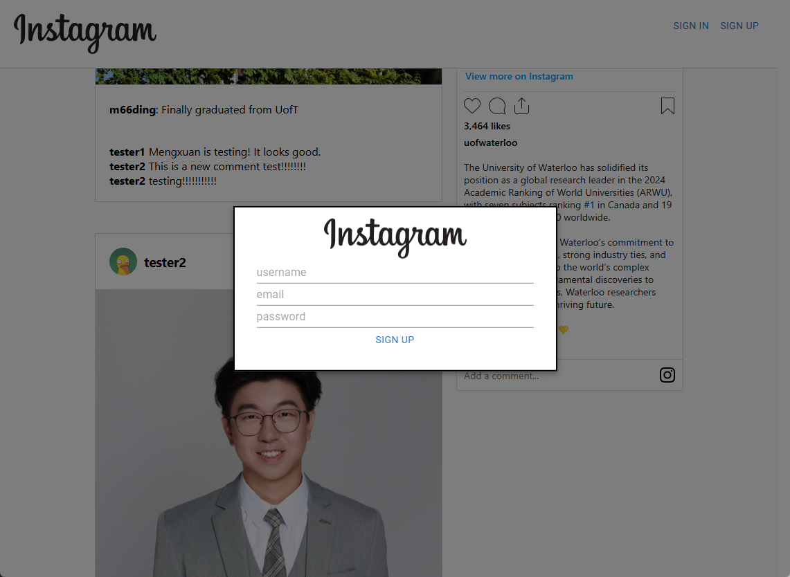

# Instagram Clone

The poject is a fully functional Instagram Clone using React, Firebase, and Material-UI, demonstrating my full-stack development skills.\
I developed the front-end with React, styled it using Material-UI and custom CSS to ensure a modern, responsive UI.\
For the backend, I integrated Firebase Firestore for real-time data updates, Firebase Authentication for secure user login, and Firebase Storage for handling image uploads.\
The app allows users to post images with captions, view multiple posts in real-time, and interact through comments.

This project was bootstrapped with [Create React App](https://github.com/facebook/create-react-app).

## Available Scripts

In the project directory, you can run:

### `npm start`

Runs the app in the development mode.\
Open [http://localhost:3000](http://localhost:3000) to view it in your browser.

